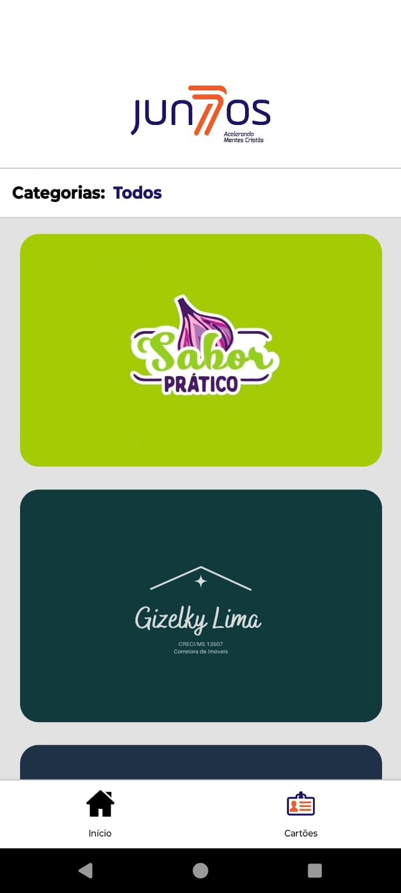
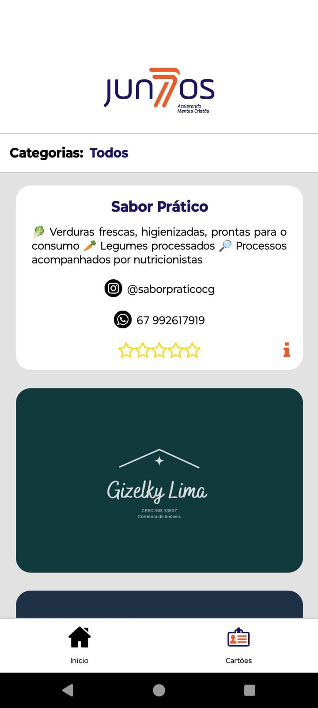
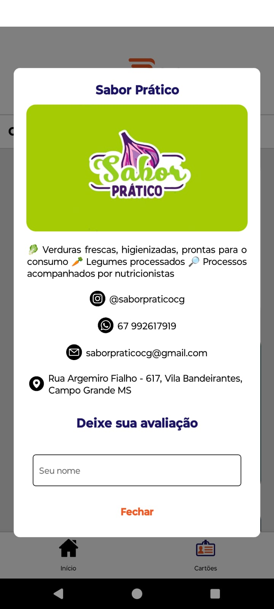

# 📱 Aplicativo Juntos - Conexão entre Empreendedores 🚀

O **Juntos** é um aplicativo desenvolvido com **Expo** e **React Native**, criado para conectar empreendedores, facilitando a interação, o cadastro e o gerenciamento de dados. A plataforma permite o cadastro de novos empreendedores, a edição de informações existentes, o gerenciamento de comentários e muito mais.

## 🔧 Funcionalidades

- **Cadastro de Empreendedores**: Os usuários podem se cadastrar na plataforma de maneira rápida e fácil.
- **Gestão de Empreendedores**: Permite a edição e atualização de dados de empreendedores já cadastrados.
- **Comentários**: Gerenciamento de comentários de empreendedores, promovendo a interação entre eles.
- **Interface Amigável**: Interface intuitiva e fácil de navegar, construída com **React Native** e **Expo**.
- **Integração com a API Juntos**: Comunicação com a API que gerencia os dados dos empreendedores e interações no banco de dados.

## 🚀 Tecnologias Utilizadas

- **React Native** com **Expo** para o desenvolvimento do aplicativo.
- **React Navigation** para navegação entre telas.
- **Axios** para realizar requisições HTTP para a API.
- **Expo Managed Workflow** para facilitar o processo de desenvolvimento.

## 📸 Prints do Aplicativo

Abaixo estão alguns prints do aplicativo **Juntos** em funcionamento:

### Tela de Carregamento

### Tela Inicial

### Tela de Cards

### Card Expandido

